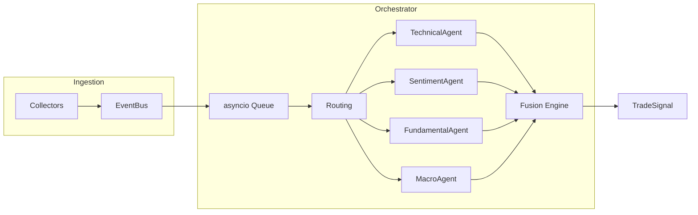

# AlphaAgent

AlphaAgent is a research-style multi-agent trading signal system built in Python.

It takes noisy market inputs — prices, news, filings, and social sentiment — converts them into a single standard format, lets multiple specialist agents analyze them, and combines their opinions into one final trading signal:

**BUY / SELL / HOLD + score + confidence**

The goal is not to build a production trading bot.

The goal is to explore how multiple AI-style agents, quantitative signals, and async systems can work together inside a small “quant research stack.”

---

# What AlphaAgent Does

Markets constantly generate different types of information:

- Price movement
- News headlines
- Earnings filings
- Social media sentiment
- Macro events

AlphaAgent:

1. Converts all of them into one standard event format
2. Sends events to the correct specialist agents
3. Collects their opinions asynchronously
4. Combines them into a final signal

So instead of hardcoding one giant strategy, you can experiment with:
- technical analysis
- sentiment analysis
- macro reasoning
- factor signals
- signal fusion

without rewriting the whole pipeline every time.

---

# Example Flow

```text
News arrives:
"NVDA beats earnings expectations"

        ↓

Converted into:
MarketEvent(type="NEWS", ticker="NVDA")

        ↓

Routed to:
- SentimentAgent
- FundamentalAgent
- MacroAgent

        ↓

Each agent returns:
PartialSignal(score, confidence)

        ↓

Orchestrator combines them

        ↓

Final output:
TradeSignal(BUY, score=0.71, confidence=0.82)
```

---

# Architecture



---

# Core Ideas

## 1. Normalize Everything

Every source becomes the same object:

```python
MarketEvent
```

That means:
- news
- price updates
- filings
- sentiment

all flow through the same pipeline.

This keeps the system modular and easy to extend.

---

## 2. Multi-Agent Analysis

Different agents specialize in different tasks.

| Agent | Purpose |
|---|---|
| TechnicalAgent | Price trends, momentum, volatility |
| SentimentAgent | News + social sentiment |
| FundamentalAgent | Financial quality / filings |
| MacroAgent | Market regime and macro context |

Each agent independently returns a:

```python
PartialSignal
```

Example:

```python
BUY, score=0.6, confidence=0.8
```

---

## 3. Signal Fusion

The orchestrator combines agent outputs using:
- confidence weighting
- decay logic
- HOLD deadbands
- async batching

This produces a final:

```python
TradeSignal
```

instead of blindly trusting a single model.

---

# Live Pipeline

Run:

```bash
python run_pipeline.py
```

Pipeline flow:

```text
Collectors
   ↓
EventBus
   ↓
asyncio.Queue
   ↓
Orchestrator
   ↓
Agents
   ↓
Fusion
   ↓
TradeSignal
```

Features:
- async event-driven architecture
- lightweight queue payloads
- pluggable agents
- real-time signal generation
- automatic markdown run reports

---

# Backtesting

Run:

```bash
python run_backtest.py
```

The backtest asks an important question:

> “Do these signals actually predict future returns?”

instead of:

> “Does the demo look smart?”

---

# Default Backtest Engine (Cross-Sectional Mode)

Default mode:

```env
ALPHAGENT_BACKTEST_CS_PANEL=1
```

This mode:
- ranks stocks relative to each other
- z-scores factors cross-sectionally
- switches regimes (trend / mean reversion / high vol)
- applies rolling IC filtering
- builds percentile-based BUY/SELL signals

---

# Legacy Mode

```env
ALPHAGENT_BACKTEST_CS_PANEL=0
```

This replays events directly through:
- Orchestrator
- TechnicalAgent
- Fusion logic

Useful for comparing old vs new approaches.

---

# Evaluation Approach

AlphaAgent includes walk-forward backtesting and cross-sectional evaluation tools.

The default backtest engine evaluates:
- relative stock strength
- factor ranking quality
- signal consistency
- short-horizon forward returns

Metrics such as Information Coefficient (IC), percentile analysis, and dollar-neutral simulations are included to help measure predictive quality beyond simple directional accuracy.

---

# Repository Structure

| Path | Purpose |
|---|---|
| `core/` | Shared models and event schemas |
| `ingestion/` | Collectors, EventBus, ingestion loop |
| `orchestrator/` | Routing, fusion, async orchestration |
| `backtest/` | Replay engine and evaluation |
| `run_pipeline.py` | Live async pipeline |
| `run_backtest.py` | Walk-forward backtest |
| `pipeline_run_report.py` | Markdown report generation |

---

# Quick Start

## 1. Setup

```bash
git clone <repo>
cd AlphaAgent

python3 -m venv .venv
source .venv/bin/activate

pip install -r requirements.txt

cp .env.example .env
```

---

## 2. Run Live Pipeline

```bash
python run_pipeline.py
```

Optional:

```bash
ALPHAGENT_USE_FINBERT=0 python run_pipeline.py
```

This disables FinBERT and uses lightweight keyword sentiment.

---

## 3. Run Backtest

```bash
python run_backtest.py
```

Reports are written to:

```text
runs/backtest_last.md
```

---

# Important Concepts

## MarketEvent

One standard structure representing:
- what happened
- which ticker
- when it happened
- metadata
- confidence

---

## asyncio.Queue

Acts like a buffer between:
- ingestion
- orchestration

Producers push events.

Consumers process them asynchronously.

This keeps the pipeline decoupled and scalable.

---

## PartialSignal vs TradeSignal

### PartialSignal
One agent’s opinion.

Example:

```text
TechnicalAgent → BUY
```

### TradeSignal
Final combined decision after fusion.

Example:

```text
BUY with 0.78 confidence
```

---

# Design Choices

## Why Async?

Market systems are naturally event-driven.

Using:

```python
asyncio
```

allows:
- parallel agent execution
- non-blocking ingestion
- scalable orchestration
- cleaner streaming workflows

---

## Why Cross-Sectional Ranking?

Many equity signals are:
- relative signals

not:
- absolute predictions

Example:
- “NVDA stronger than peers”
is often more reliable than:
- “NVDA definitely goes up tomorrow”

---

## Why Explicit Fusion?

Fusion is:
- transparent
- configurable
- debuggable

instead of a black-box “AI decides everything” system.

---

# Technologies Used

| Area | Stack |
|---|---|
| Language | Python |
| Async System | asyncio |
| Market Data | yfinance |
| NLP | FinBERT |
| Transformers | Hugging Face |
| Config | dotenv |
| Feeds | feedparser |


---

# Disclaimer

AlphaAgent is a research and educational project.

It is **not** production trading software and should not be used to make real financial decisions.

Past simulated performance does not guarantee future results.
